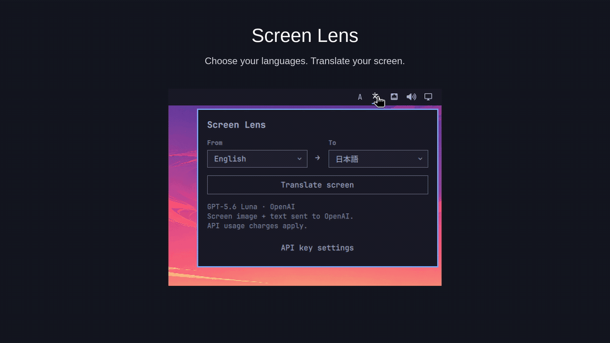
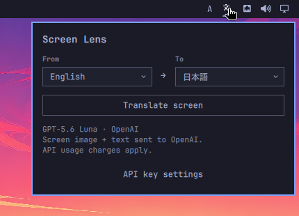

# Screen Lens

Translate a snapshot of your Omarchy desktop into your language.

Screen Lens translates visible text in browsers, terminals, chat apps and other
applications without modifying them. It uses local OCR and GPT-5.6 Luna with image
context. An OpenAI API key with API billing is required.



Actual translation results. This edited comparison omits the 20.3-second processing wait.

Choose your source and target languages from the Omarchy panel, then click **Translate screen**.



## Install

Requires Omarchy on x86-64 with Python 3.14. No GPU is required.

### 1. Install the package

Install [screen-lens-bin from the AUR](https://aur.archlinux.org/packages/screen-lens-bin):

```sh
yay -S screen-lens-bin
```

The package includes the application, its Omarchy panel and OCR models. Dependencies
are installed by the package manager; no virtual environment or manual model
download is needed. The package uses a prebuilt CPU ONNX Runtime, hence the
`-bin` name. You do not need to run `omarchy plugin add` separately.

### 2. Enable the panel

Open **Screen Lens** from the Omarchy application menu once. This enables the
translation icon in your bar. Do this for each user who wants to use the panel.

### 3. Set your API key

Click the translation icon, open **API key settings**, enter your OpenAI API key,
and click **Save**. You can then choose your languages and click **Translate screen**.
The key is stored in your desktop keyring and reused on subsequent launches.
A persistent Secret Service provider, such as GNOME Keyring, must be available
and unlocked. A ChatGPT subscription does not replace API billing.

### Migrating from a manual installation

If you previously installed the plugin from Git, remove that panel before step 2:

```sh
omarchy plugin remove komagata.screen-lens
```

Then open **Screen Lens** from the application menu again. Existing API keys are
retained. Existing manual runtime directories and launchers are not deleted;
update any custom shortcut that still points to an old checkout.

The application occupies approximately 90 MB, excluding shared dependencies,
package-manager caches and translation results. Additional dependency storage
depends on what your machine already has installed.

## Use

1. Open the translation icon in the bar.
2. Choose **From** and **To**.
3. Click **Translate screen**.
4. Wait for the rotating icon to stop and the translated snapshot to appear.

Both selectors support Japanese, English, Simplified Chinese, Spanish and French.
The source defaults to English. The destination defaults to your locale
(`LC_ALL`, then `LC_MESSAGES`, then `LANG`), unless you saved a selection.
Unsupported locales and C/POSIX fall back to English; Traditional Chinese is not
automatically mapped to Simplified Chinese.

Only the focused monitor is captured. The result is a frozen image, not an
interactive translated application.

| Action | Result |
| --- | --- |
| Esc or click the translation icon | Close or cancel |
| Space | Compare the captured original and translation |
| Click, scroll or type | Close; the first action is consumed, not forwarded |
| Run the translation command again | Close the current snapshot |
| Window or workspace change notification | Request dismissal |

The original shown with Space is also a snapshot. Video and automatic page
updates are not tracked. Continuous translation is not supported in normal use.

For terminal use or a custom shortcut:

```sh
/usr/bin/screen-lens --lt --lt-fast
```

No global shortcut is assigned automatically. Choose an unused key combination.
The snapshot closes automatically after 120 seconds; `--timeout SECONDS` changes
this. Language overrides for one invocation are `--source en --target ja`.

## Privacy and API key

**Screen images and recognized text are sent to OpenAI for translation.**
They can contain messages, documents, credentials and personal information.
There is no reliable automatic secret redaction. Do not translate screens
containing information you do not want to send to OpenAI. API usage costs money.

Requests use `store: false`; this does not guarantee zero provider retention.
Keys are saved with Secret Service attributes `application=screen-lens` and
`service=openai`. There is no gopass dependency or plaintext-file fallback.
Replace a key through **API key settings**. An `OPENAI_API_KEY` environment variable
takes precedence over the saved key. Saving a key does not validate API access.

Temporary screenshots are stored privately under `XDG_RUNTIME_DIR` and removed
on normal exit. Abrupt termination can leave files until cleanup or logout.
Do not share these directories in bug reports.

Up to eight translated snapshots are cached privately in
`$XDG_RUNTIME_DIR/screen-lens-snapshot-cache/`. Entries expire after 15 minutes
and are removed on the next cache access. Exact matching screens can bypass OCR
and translation; small changes such as a clock cause a miss. Language choices
and runtime code are also part of the cache key.

## Limitations and troubleshooting

- OCR and translation can miss text, change meaning or produce small text.
  Verify important numbers, commands, URLs and negation against the original.
- English input and Japanese output have the broadest testing. Other supported
  language pairs may have lower quality. RTL and vertical text are unsupported.
- Large images are reduced to 2560 pixels on the longest side. Small text,
  photo-backed text and dense layouts can remain untranslated.
- Text that cannot be drawn safely or fit in the available space stays unchanged.
- Processing time depends on the CPU, screen content, network and API latency.
  Translation has a 60-second deadline.
- The packaged native runtime currently requires Python 3.14. A later Python
  minor version requires an updated package.

If a snapshot gets stuck, press Esc or run the same translation command again.
For an error opening API key settings, enable the panel from the application menu
and check that your desktop keyring is unlocked.

## Update and remove

Update through your usual AUR helper. To remove the panel, then the package:

```sh
omarchy plugin remove komagata.screen-lens
sudo pacman -R screen-lens-bin
```

The panel is a user-owned link to the package in `/usr/lib/screen-lens`.
Package removal does not change other users' settings. Each user who enabled
the panel should remove their link. Keyring entries, custom shortcuts, manually
installed older runtimes and cached snapshots are retained. Remove saved keys
separately with your desktop keyring manager.

## How it works

`grim` captures the monitor. RapidOCR uses a PP-OCRv5 mobile detector and
PP-OCRv6 small recognizer through CPU ONNX Runtime. GPT-5.6 Luna receives the
image and text context, and Pango/Cairo render translated text at estimated
source sizes. Quickshell displays the result as an overlay.

## License

[MIT](LICENSE). Third-party components retain their own licenses.
The translation icon is Lucide's `languages`, under the
[ISC license](assets/LICENSE-lucide.txt).

For bug reports, include versions, resolution, scaling and a non-sensitive
reproduction. Do not attach API keys or private screenshots.
